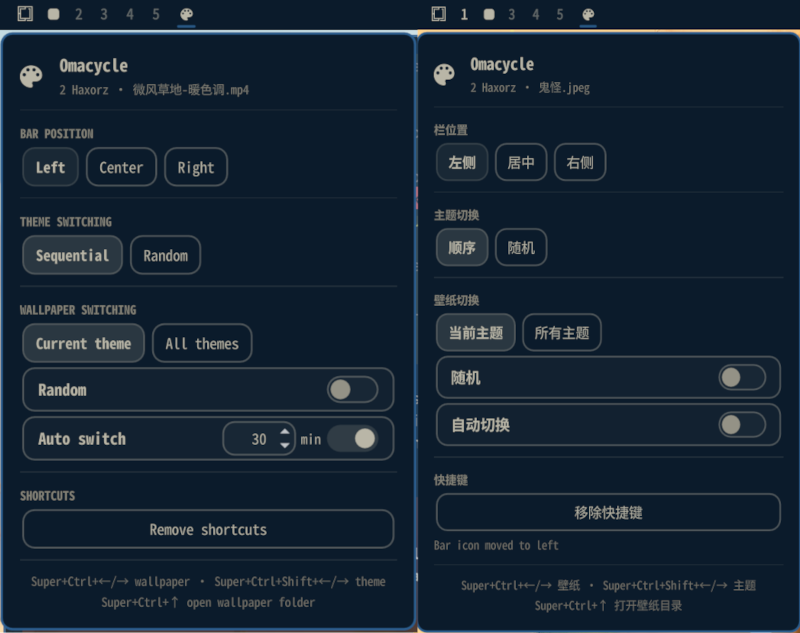

# Omacycle

[English](README.md)

一键循环切换所有已安装的 Omarchy 主题和壁纸，可以选择顺序或随机切换，只轮换当前主题壁纸或全部主题的壁纸，面板跟随当前主题配色。



## 功能介绍

- **主题循环** — `Super+Ctrl+Shift+Left` / `Super+Ctrl+Shift+Right` 按顺序
  循环所有已安装主题并首尾相接，或随机跳转到非当前主题。
- **壁纸循环** — `Super+Ctrl+Left` / `Super+Ctrl+Right` 循环当前主题的壁纸，
  或全部主题的壁纸，可顺序或随机。
- **打开壁纸目录** — `Super+Ctrl+Up` 在默认文件管理器中打开当前壁纸所在目录。
- **状态栏面板** — 选择图标位置（左/中/右）、主题与壁纸模式、定时轮换壁纸，以及
  启用或移除快捷键。面板使用 Omarchy 主题 token，主题变化时自动重配色。
- **受管理的按键块** — 所有快捷键（包括打开壁纸目录）以一个专属 fenced block
  写入 `~/.config/hypr/bindings.lua`，插件不触碰块以外的内容，移除后原样恢复。

## 运行要求

- Omarchy 4，支持 Quattro shell 插件。
- Python 3（仅标准库），用于清单和按键 helper。
- `hyprctl`（Hyprland 自带），用于安装和校验快捷键。
- 不访问网络，不常驻后台进程，不需要提权。

## 安装

```bash
omarchy plugin add https://github.com/playGitboy/omarchy-theme-wallpaper-cycler.git --enable
```

启用时可设置图标所在位置：

```bash
omarchy plugin enable io.github.playgitboy.theme-wallpaper-cycler --section right
```

`left`、`center`、`right` 均可用，之后也可随时在面板的 **Bar position**
区域中更改。

## 使用

点击状态栏中的调色板图标打开面板。中国大陆地区 locale（如 `zh_CN`、`zh-Hans-CN`）
下常用面板文字显示为简体中文，其他地区显示英文。

| 控件 | 作用 |
| --- | --- |
| Bar position | 图标在左/中/右的位置 |
| Theme switching | `Sequential` 顺序或 `Random` 随机 |
| Wallpaper source | `Current theme` 当前主题或 `All themes` 所有主题 |
| Random | 独立开关：从所选范围随机取一张壁纸 |
| Auto switch | 定时轮换壁纸的间隔分钟数，默认关闭 |
| Shortcuts | 启用或移除 `bindings.lua` 中的按键块 |

面板打开时的键盘操作：`j`/`k` 或 `↑`/`↓` 移动，`h`/`l` 切换控件，
`Enter` 激活，`Esc` 关闭。`t`、`w`、`r`、`a`、`e` 分别是主题模式、壁纸范围、
随机、自动切换、启用或移除快捷键。

### 默认快捷键

| 快捷键 | 作用 |
| --- | --- |
| `Super+Ctrl+Shift+Left` | 上一个主题 |
| `Super+Ctrl+Shift+Right` | 下一个主题 |
| `Super+Ctrl+Left` | 上一张壁纸 |
| `Super+Ctrl+Right` | 下一张壁纸 |
| `Super+Ctrl+Up` | 打开当前壁纸所在目录 |

### IPC

```bash
omarchy-shell io.github.playgitboy.theme-wallpaper-cycler status
omarchy-shell io.github.playgitboy.theme-wallpaper-cycler themeNext
omarchy-shell io.github.playgitboy.theme-wallpaper-cycler wallpaperPrev
omarchy-shell io.github.playgitboy.theme-wallpaper-cycler setSetting themeMode random
omarchy-shell io.github.playgitboy.theme-wallpaper-cycler enableKeybindings
omarchy-shell io.github.playgitboy.theme-wallpaper-cycler disableKeybindings
```

## 设置项

设置以扁平键的形式存放在插件自己的 `~/.config/omarchy/shell.json` entry 中，
与官方组件一致：

```json
{
  "id": "io.github.playgitboy.theme-wallpaper-cycler",
  "themeMode": "sequential",
  "wallpaperScope": "current",
  "wallpaperRandom": false,
  "autoWallpaper": false,
  "autoWallpaperMinutes": 30
}
```

也可以用 `omarchy bar set` 设置：

```bash
omarchy bar set io.github.playgitboy.theme-wallpaper-cycler themeMode random
omarchy bar set io.github.playgitboy.theme-wallpaper-cycler wallpaperScope all
omarchy bar set io.github.playgitboy.theme-wallpaper-cycler wallpaperRandom true
omarchy bar set io.github.playgitboy.theme-wallpaper-cycler autoWallpaper true
omarchy bar set io.github.playgitboy.theme-wallpaper-cycler autoWallpaperMinutes 30
```

## 快捷键冲突与移除

启用快捷键会向 `~/.config/hypr/bindings.lua` 追加一个 fenced block：

```lua
-- BEGIN io.github.playgitboy.theme-wallpaper-cycler
hl.unbind("SUPER + CTRL + LEFT")
hl.unbind("SUPER + CTRL + RIGHT")
o.bind("SUPER + SHIFT + CTRL + LEFT", "Previous theme (Omacycle)", hl.dsp.global("io.github.playgitboy.theme-wallpaper-cycler:theme-prev"))
-- ...
-- END io.github.playgitboy.theme-wallpaper-cycler
```

helper 会先备份文件（`bindings.lua.bak.<时间戳>`），通过同目录临时文件写入，
并拒绝符号链接和非普通文件。写入前会检查实时 `hyprctl binds` 列表以及用户自己的
`o.bind(...)` 行。已被其他组件占用的快捷键**绝不会被静默覆盖**：面板会显示当前
占用者并询问是否接管，只有确认后 helper 才会写出 `hl.unbind(...)`。

Omarchy 默认把 `Super+Ctrl+Left/Right` 绑定为 *Move grouped window focus*，
因此首次启用时面板会提示该冲突，点击 **Enable & take over** 后才会接管这两个键。
`Super+Ctrl+Shift+Left/Right` 通常空闲。移除按键块不会恢复被接管的键，如需要请自行
重新添加绑定。

## 兼容性

- 在 Omarchy `4.0.0.r2186.gee8ebf6-1`（Quattro shell）、Arch Linux、Hyprland
  Lua 配置 API、Wayland 上构建并测试。
- 以 `omarchy-version` 报告的已安装 Omarchy 版本为准，而非 ISO 镜像版本。
- 仅使用有文档的接口：`qs.Commons`（`Color`、`Style`、`Border`）、
  `qs.Ui`（`Panel`、`KeyboardPanel`、`BarIconButton`、`ButtonGroup`、`Toggle`）、
  `Quickshell.Hyprland.GlobalShortcut`、`Quickshell.Io.Process`，以及
  `omarchy theme`、`omarchy theme bg`、`omarchy bar` 命令。
- 弹层内容优先选择当前弹层文字 token，并校验其与弹层背景的对比度，对 bar 与
  弹层 token 不一致的主题回退到可读的黑或白。
- 壁纸顺序复现 Omarchy 自身的 `find … | sort -z` 枚举方式（与
  Super+Ctrl+Space 壁纸切换器和 `omarchy theme bg next` 一致），包含当前主题的
  staged 壁纸目录以及会话 locale 的排序规则，因此排序与用户在本机看到的
  系统切换器一致。
- 主题顺序与 Super+Shift+Ctrl+Space 主题切换器一致，依据切换器预览菜单所用的
  `<主题>.<预览扩展名>` 名称排序，使 `catppuccin`、`catppuccin-latte` 这类
  前缀同名主题按选择器中的顺序前进；模型不会重新排序 helper 给出的列表。
- 单个 service 实例拥有快捷键和清单，bar widget 只是每屏视图，因此无论多少屏幕
  或多少 bar 副本，快捷键只注册一次。
- 主题和壁纸同时从系统主题目录以及用户自己的 `~/.config/omarchy/themes`、
  `~/.config/omarchy/backgrounds` 中发现，包括符号链接形式的用户主题目录。
  图片和视频扩展名与 Omarchy 自身列表一致。

## 校验与测试

```bash
./tests/run
omarchy plugin validate .
```

`./tests/run` 会运行 Node 下的 `Model.js` 决策测试、Python 下的清单与按键
管理测试、helper 的 `py_compile` 检查、可移植 manifest 校验器，以及在可用时
运行 `omarchy plugin validate`。`./demo/run` 是确定且可逆的离线演示，不会触碰
真实桌面。

## 更新

```bash
omarchy plugin update io.github.playgitboy.theme-wallpaper-cycler
```

## 卸载

先在面板中移除按键块（或运行 `bin/theme-cycler binds remove`），然后：

```bash
omarchy plugin remove io.github.playgitboy.theme-wallpaper-cycler
```

插件除自己的 `shell.json` entry 和 fenced `bindings.lua` 块之外不保存任何内容。

## 安全

Omarchy 插件以无沙箱代码形式运行在 `omarchy-shell` 中，启用前请审阅本仓库。
本插件只读取主题和壁纸目录，只写入自己的 `shell.json` entry 和自己的 fenced
`bindings.lua` 块，并以参数数组方式运行 `omarchy`/`hyprctl` 命令。它不使用
网络，也不请求提权。

## 许可

MIT © 2026 playGitboy
